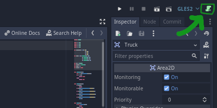

# EditorSwitcher

EditorSwitcher adds a button that allows for quick switching between the native script editor and the external script editor

## How to use

1. Add the plugin to your project and enable it.
3. Activate or deactivate the external editor by clicking the switcher button on the top right corner of Godot editor.

